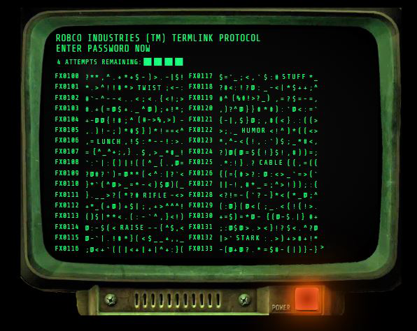

# Fallout Terminal Hacking Game



## Overview

This is a fan-made recreation of the terminal hacking minigame from the Fallout series. It simulates the iconic green-on-black terminal interface where players must guess the correct password within a limited number of attempts. I originally developed this game on [Codepen](https://codepen.io/TiredDev/pen/ejGNgK) when I was a student, in 2018.

## Features

- Authentic RobCo Industries terminal interface
- Randomized passwords from a curated word list
- Four attempts to guess the correct password
- Helpful hints that remove incorrect options (duds)
- Character-matching feedback system
- Typewriter text effect for immersion
- Victory and failure states with appropriate messages

## How to Play

1. Click the power button to boot up the terminal
2. You have 4 attempts to guess the correct password
3. Click on any word to make a guess
4. If wrong, you'll see how many characters match the correct password
5. Click on brackets and symbols like `{}, (), [], <>, etc.` to possibly remove incorrect passwords
6. Win by selecting the correct password before running out of attempts

## Technologies Used

- HTML5
- CSS3 (with custom animations)
- Vanilla JavaScript (no frameworks or dependencies)

## Setup and Installation

1. Clone the repository:
   ```
   git clone https://github.com/yourusername/fallout-terminal.git
   ```

2. **Option 1: Simple Setup**
   - Open `index.html` directly in your web browser

3. **Option 2: Using npm (Recommended)**
   - Install Node.js if you haven't already: [https://nodejs.org/](https://nodejs.org/)
   - Navigate to the project directory in your terminal/command prompt
   - Install dependencies:
     ```
     npm install
     ```
   - Run the development server:
     ```
     npm run serve
     ```
   - The project will open automatically in your default browser at http://localhost:3000
   - Any changes you make to the files will automatically reload the page

4. **Option 3: Using live-server globally**
   - Install Node.js if you haven't already: [https://nodejs.org/](https://nodejs.org/)
   - Install live-server globally:
     ```
     npm install -g live-server
     ```
   - Navigate to the project directory in your terminal/command prompt
   - Run the following command:
     ```
     live-server
     ```
   - The project will open automatically in your default browser
   - Any changes you make to the files will automatically reload the page

Using the npm script or live-server provides a local development server with auto-reload functionality, making it easier to develop and test changes.

## Customization

You can modify the game by:
- Adding words to the password list in the JavaScript file
- Adjusting the typing speed by changing the `speed` variable
- Modifying the CSS for different visual effects

## Disclaimer

This is a fan project created for educational and entertainment purposes. The Fallout series and all related intellectual property are owned by Bethesda Softworks LLC, a ZeniMax Media company. This project is not affiliated with, endorsed by, or connected to Bethesda Softworks or ZeniMax Media in any way.

## License

This project is available under the MIT License.

## Acknowledgments

- Bethesda Game Studios for creating the Fallout series and its iconic hacking minigame
- The Fallout community for their continued enthusiasm for the series
